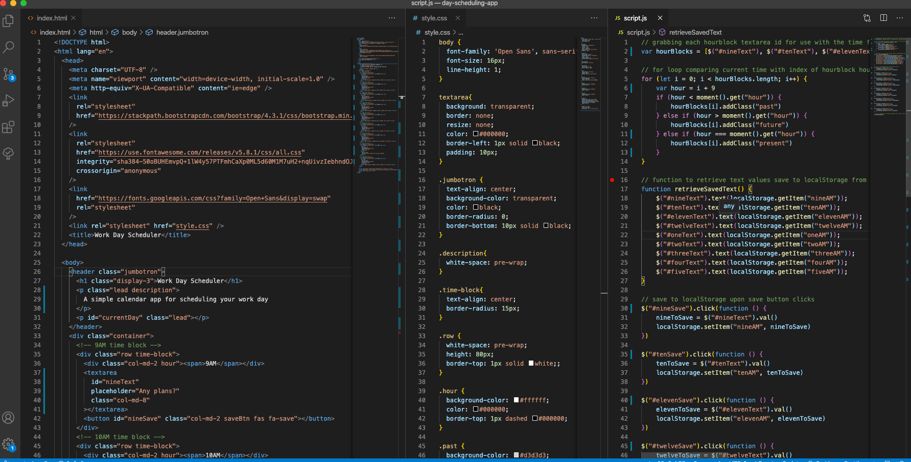
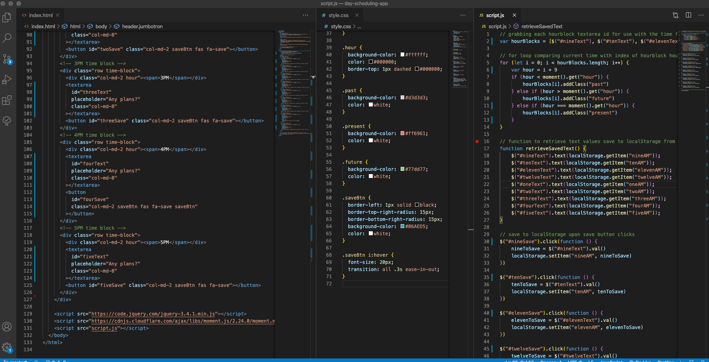

# day-scheduling-app

This is a simple day planner application that allows the user to save events for each hour of the day. This app will run in the browser and features dynamically updated HTML and CSS powered by jQuery.

I made this project to experiment with moment.js, localStorage, and jQuery. You can use the app by inputting significant things in the hour blocks, and these will remain until you clear them, even upon page refresh. As the hours of the day pass, the colors of the hour blocks change. Hours that have not yet transpired will be highlighted with green. The current hour will be orange. Hours already passed will be grey. When the user has written text inside one of the hour blocks, they can then click a save button to save that text for future reference. 

It's basic code, but here is what it looks like: 

I used bootstrap to build the layout in the .html file. I essentially made 9 divs to represent the hour blocks. Each of these has a text area where the user inputs the text they want to be saved to the hour block. The text area and save buttons are both have IDs to be referred to in the .js file. 

In the .js code, I made an array of each hours' text box IDs. These elements are then used in a 'for loop' function. The index number is compared with the current time in order for the color differentiation classes to be activated for each text block, using DOM manipulation. 

Beneath this, a function retrieves the values of each text block from local storage so that anything previously saved to these will be shown on the page. 

Beneath this function, I made separate click events for each save button so that text block values could be saved to local storage.
